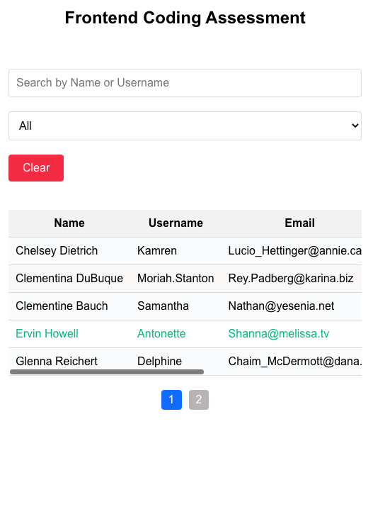

Accomplishment: In this application, I implemented the fetching of data from an API and displaying it in a table. 
This is implemented with React, Redux and wrote unit test

Steps to run and test the app:

    Clone or download the file from this repo to your local machine.
    Change directory into the root folder and run npm install.
    Run npm start to run the app and navigate to the appropriate port in your browser.
    You can then search, filter, select by gender and check every other features in the requirements.
    To run the test, in your terminal, run <npm run test>.
    The tests contains basic tests to mock some features of how the components, store and reducer function ought to work. It is unit tests. There is also a possibility for me to write end to end integration tests for it. But I just did the unit tests for now.

The API endpoint to fetch data from is https://jsonplaceholder.typicode.com/users. Fetch the data when the application loads.

Live Link for testing
https://table-with-react-redux.vercel.app/

Project Screen Shot(s)

